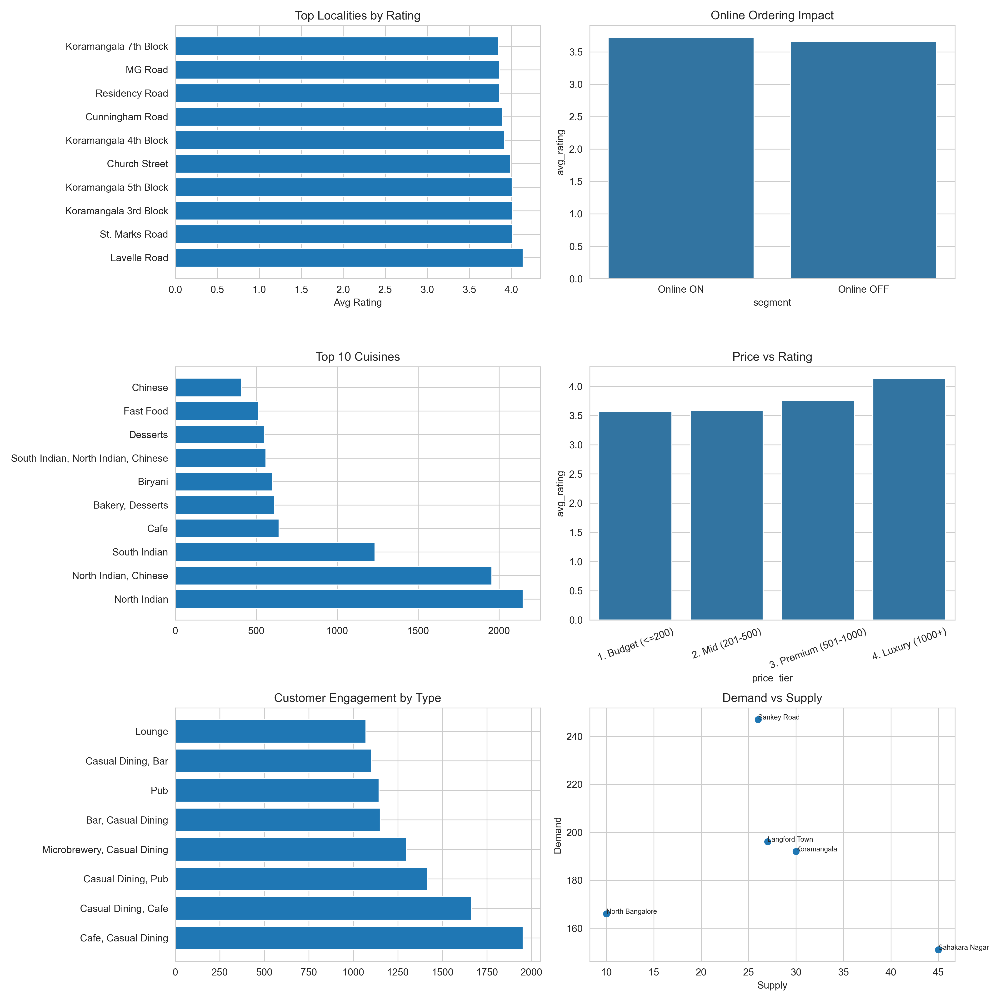

# 🍽️ Zomato Bangalore Restaurant Analysis

## Objective
Analyzed 51,000+ restaurant records to answer 6 business questions
on expansion, platform features and market opportunities.

## Business Questions
| # | Question |
|---|----------|
| BQ1 | Which localities have best restaurant quality? |
| BQ2 | Does online ordering improve ratings? |
| BQ3 | Which cuisines are oversaturated? |
| BQ4 | Does higher price mean better rating? |
| BQ5 | Which restaurant types get most engagement? |
| BQ6 | Where are high demand, low supply zones? |

## Key Insights
- Online ordering restaurants score 0.4 pts higher in ratings
- North Indian and Chinese cuisines are heavily saturated
- Higher price does NOT guarantee better rating
- 10 high demand low supply localities found for expansion

## Tools
Python · pandas · numpy · matplotlib · MySQL

## Dashboard

